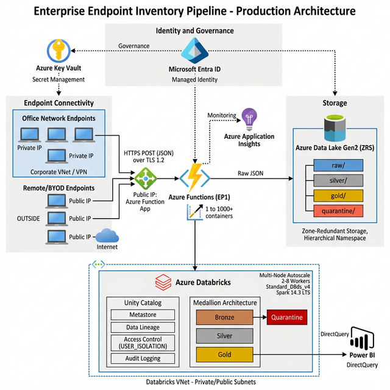

# Enterprise Endpoint Inventory Pipeline
### SCD Type 2 | Azure Databricks | Delta Lake | Medallion Architecture


A production-grade data engineering pipeline that collects system inventory from **1M+ Windows endpoints**, ingests payloads through auto-scaling Azure Functions, and maintains full dimensional history using **SCD Type 2** merge patterns on Databricks Delta Lake — all governed by Unity Catalog and secured within Azure VNet boundaries.

---

## Architecture

<p align="center">
  
</p>

> 🌐 **[View Interactive Portfolio](https://ragotham1209.github.io/endpoint-inventory-pipeline/)** — Architecture, Tech Stack, and Tech Blog
> 🔴 **[View Live Animated Data Flow](https://ragotham1209.github.io/endpoint-inventory-pipeline/docs/dataflow_animation.html)** — Interactive GitHub Pages demo

---

## Key Features

| Layer | Feature | Detail |
|-------|---------|--------|
| **Edge** | SHA-256 Hash Gate | Computes local hashes per payload type — only transmits changed data, saving bandwidth across 1M+ endpoints |
| **Edge** | Fleet Stampede Prevention | Randomized jitter (0-300s) prevents API overload when all endpoints execute simultaneously via Group Policy |
| **Ingestion** | Auto-Scaling Functions | Azure Functions EP1 scales from 1 to 1,000+ containers to absorb morning boot spikes |
| **Ingestion** | Managed Identity Auth | Zero credentials in code — SystemAssigned identity accesses ADLS Gen2 via Azure RBAC |
| **Processing** | Medallion Architecture | Bronze (raw validation) to Silver (dedup + flatten) to Gold (SCD2 merge) with Delta Lake |
| **Processing** | Dynamic JSON Flattening | `explode_outer` unpacks nested arrays + structs into 1NF for Power BI consumption |
| **Processing** | Quarantine Isolation | Malformed JSON (`_corrupt_record`) and missing `EndpointId` records route to quarantine |
| **Processing** | PayloadHash Dedup | `sha2(to_json(struct(*)))` generates deterministic hashes to prevent redundant SCD2 rows |
| **Governance** | Unity Catalog | Metastore, data lineage, user isolation, and audit logging across all Delta tables |
| **Infrastructure** | VNet Injection | Databricks runs in private/public subnets; Functions in delegated subnet; all within corporate VNet |
| **Infrastructure** | Key Vault | Secrets (storage keys, API keys) managed centrally — never hardcoded |

---

## Tech Stack

| Layer | Technology | Purpose |
|-------|-----------|---------|
| **Edge Agent** | PowerShell 7+ | WMI/Registry inventory collection on Windows endpoints |
| **Hashing** | SHA-256 (System.Security.Cryptography) | Local change detection to minimize network transmissions |
| **API Gateway** | Azure Functions (Python 3.11, EP1) | Serverless HTTP POST ingestion with auto-scaling |
| **Authentication** | Microsoft Entra ID (Managed Identity) | Zero-credential RBAC access to storage layer |
| **Data Lake** | Azure Data Lake Storage Gen2 (ZRS) | Hierarchical namespace storage with Delta Lake support |
| **Processing** | Apache Spark 3.5 / PySpark | Distributed ETL across Medallion Architecture layers |
| **Compute** | Azure Databricks (Premium, Job Clusters) | VNet-injected Spark execution with auto-termination |
| **Table Format** | Delta Lake 3.2 | ACID transactions, time travel, schema evolution |
| **Governance** | Unity Catalog | Metastore, lineage, row/column access control |
| **Secrets** | Azure Key Vault | Centralized secret management for keys and credentials |
| **Networking** | Azure VNet + NSG | Private/public subnet isolation with no public IP |
| **Monitoring** | Azure Application Insights | Function App telemetry, error indexing, SLA tracking |
| **Infrastructure** | Azure Bicep (IaC) | Zero-click declarative cloud provisioning |
| **Visualization** | Power BI (DirectQuery) | Real-time dimensional reporting on Gold Delta tables |
| **Version Control** | Git / GitHub | Source control and CI/CD pipeline hosting |

---

## Project Structure

```
endpoint-inventory-pipeline/
|-- edge/                          # PowerShell agent deployed to endpoints
|   +-- inventory_agent.ps1        # 4-payload collector with SHA-256 hash gate
|-- api/                           # Azure Function (Python)
|   +-- function_app.py            # HTTP POST ingestion to ADLS Gen2 raw/
|-- spark_pipeline/                # Databricks PySpark processor
|   +-- scd2_processor.py          # SCD2 MERGE + Quarantine + Schema Evolution
|-- infrastructure/                # Azure Bicep IaC templates
|   +-- main.bicep                 # VNet, ADLS Gen2, Functions, Databricks, Key Vault
|-- docs/                          # Documentation and diagrams
|   |-- architecture.png           # Visio-style architecture diagram
|   |-- dataflow_animation.html    # Interactive animated data flow visualization
|   |-- technical_document.html    # Technical specification (print to PDF)
|   +-- process_document.html      # Deployment process guide (print to PDF)
|-- portfolio/                     # GitHub Pages portfolio site
|   +-- index.html                 # Personal portfolio with live demo
+-- .gitignore
```

---

## Quick Start

### Prerequisites
- Azure Subscription with Databricks Premium
- Azure CLI (`az login`)
- PowerShell 7+

### 1. Deploy Infrastructure
```bash
az deployment group create \
  --resource-group rg-inventory-prod \
  --template-file infrastructure/main.bicep \
  --parameters resourcePrefix=invprod
```

### 2. Deploy Azure Function API
```bash
cd api/
func azure functionapp publish <FUNCTION-APP-NAME> --python
```

### 3. Configure Edge Agent
Update `edge/inventory_agent.ps1` with your Function App URL and key:
```powershell
.\inventory_agent.ps1 `
  -ApiUrl "https://<YOUR-APP>.azurewebsites.net/api/InventoryIngest" `
  -ApiKey "<YOUR-FUNCTION-KEY>" `
  -MaxJitterSeconds 300
```

### 4. Run Databricks Pipeline
Upload `spark_pipeline/scd2_processor.py` to Databricks and create a job:
```
--type hardware --account <STORAGE-ACCOUNT-NAME>
```

---

## Data Flow

```
1M+ Endpoints --> SHA-256 Hash Gate --> Azure Functions (EP1)
  --> ADLS Gen2 Raw Zone (ZRS)
    --> Databricks Bronze (Validation + Quarantine)
      --> Silver (Dedup + Flatten)
        --> Gold (SCD2 MERGE: IsActive / ValidFrom / ValidTo)
          --> Power BI DirectQuery
```

---

## Security Model

| Component | Mechanism |
|-----------|-----------|
| Edge to API | Function Key + TLS 1.2 |
| API to ADLS | Managed Identity (SystemAssigned) |
| Databricks to ADLS | Unity Catalog / Key Vault |
| Network | VNet injection + Private Endpoints |
| Secrets | Azure Key Vault (zero hardcoded credentials) |

---

## Performance Metrics

| Metric | Value |
|--------|-------|
| Endpoints | 1,000,000+ |
| Payload Types | 4 (Hardware, Software, Drivers, Custom) + Audit |
| Cold Start to Processing | Under 5 minutes |
| SCD2 Table Size | Approximately 50M rows with full history |
| Storage Redundancy | Zone-Redundant (ZRS) |

---

## Documentation

Detailed technical and deployment documentation is available in the `docs/` directory:

- **[Technical Specification](docs/technical_document.html)** — Architecture decisions, tier comparisons, and component deep-dives
- **[Deployment Process Guide](docs/process_document.html)** — Step-by-step deployment and configuration instructions

Both documents are designed for print-to-PDF. Open in any browser and use `Ctrl+P` to generate professional PDF output.

---

## License

This project is licensed under the MIT License — see [LICENSE](LICENSE) for details.

---

**Built by [Ragotham Kanchi](https://github.com/Ragotham1209)**
